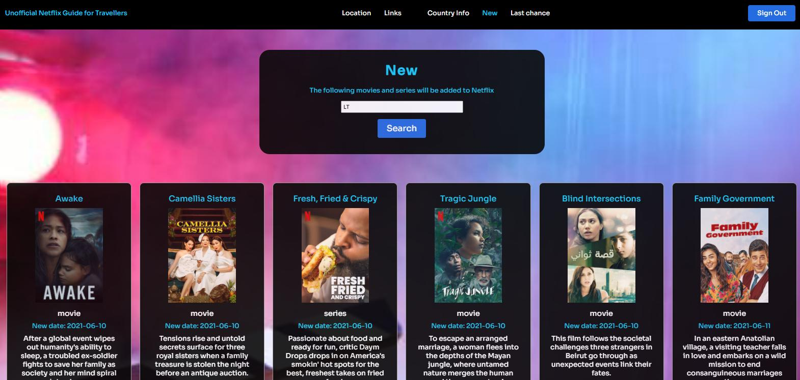

# Inleiding
Deze opdracht beschrijft de website "Unofficial Netflix Guide for Travellers".
Het probleem is dat als u op zakelijke reis of op vakantie gaat, u nooit weet of uw favoriete films en series beschikbaar 
zijn op hun bestemming, omdat het content op Netflix per land verschilt. Zo kunt u bijvoorbeeld in Indonesië niet naar
Lucifer kijken maar in nederland en Australië wel.

Het doel van de website is om reizigers die graag Netflix gebruiken tijdens hun reizen informatie te verschaffen over 
welke films en series hun kunnen bekijken op hun bestemming.
En ze kunnen ook zien welke films en series er zullen worden verwijderd en toegevoegd worden op hun bestemming.

# Lijst met benodigdheden
1. Git en Github
2. Email account
3. API key van https://english.api.rakuten.net/unogs/api/unogs

# Installatie handleiding
1. Clone de github repository.
2. Installeer node_modules door `npm install` in de terminal in te voeren en druk op enter.
3. De applicatie kan gestart worden door `npm start` in de terminal in te voeren en op enter te drukken. De applicatie opent een tab met http://localhost:3000 in uw browser.

# Testen
De testen zijn te vinden in de map Tests/Test.js

Om de testen uit te voeren typ in de terminal: `npm run test`

# Registreren en inloggen
1. Voor deze applicatie wordt gebruikt gemaakt van de Novi database. Bij eerste keer registreren kan het zijn dat het 30 seconden duurt voordat de u wordt door geleid.
2. Als u op de `Get Started` knop klikt wordt u doorverwezen naar de Register pagina.
3. Op de Register pagina dienen alle velden te worden ingevuld, met uw eigen gegevens.
4. Klik op de `Create account` knop of druk op enter.
5. Als alle gegevens correct zijn ingevuld wordt u doorverwezen naar de Sign in pagina.
6. Vul hier uw gebruikersnaam en wachtwoord in en klik op de `Sign in` knop of druk op enter.
7. Nu u bent ingelogd wordt u doorverwezen naar de Profile pagina, vanuit hier kunt u verder navigeren naar de rest van de afgeschermde pagina's die nu ook in de navbar worden weergegeven.

# Scripts NPM
### `npm install`
Installeert alle node_modules.

### `npm start`
Hiermee start u het project in de development mode.

### `npm build`
Maakt een HTML, CSS en JavaScript bestand voor productie.

### `npm run test`
Voert de testen uit.

